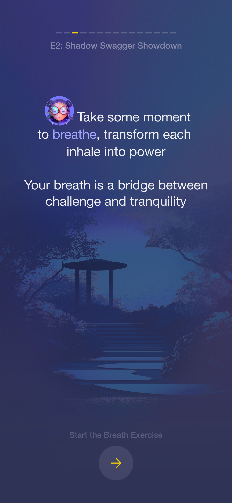
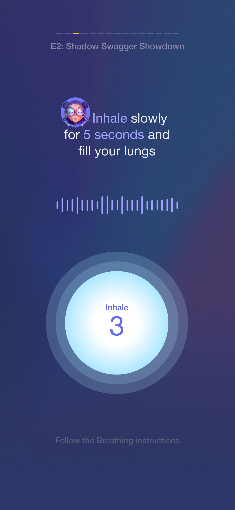
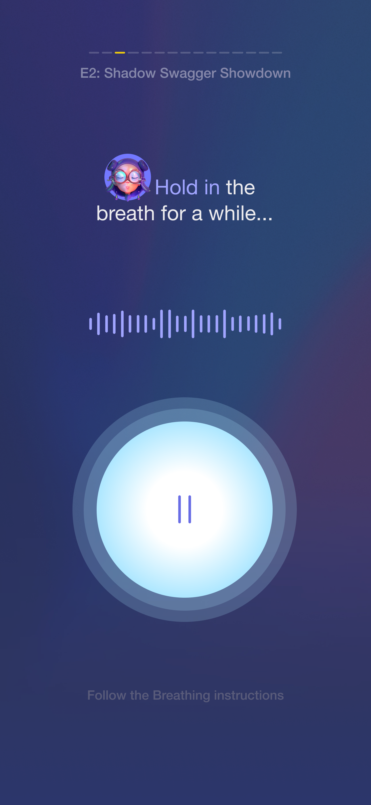

<div align="center">


# 🧘‍♂️ FutureStars Breathing Exercise

**A guided breathing experience for young sports talents**

*Transform each breath into power, strength, and calm*

[](https://flutter.dev)
[](https://dart.dev)
[](https://flutter.dev/multi-platform)

</div>

---

## 📱 Overview

FutureStars Breathing Exercise is a mobile application designed to help young athletes mentally reset and refocus between challenges. Through guided breathing exercises narrated by "The Oracle," athletes learn to harness their breath as a tool for strength, discipline, and calm.

The app delivers an immersive experience featuring smooth animations, high-quality audio guidance, and calming music across four distinct breathing phases: **Inhale**, **Hold**, **Exhale**, and **Success**.

## ✨ Features

### 🎯 Core Breathing Experience
- **5-Phase Journey**: Intro → Inhale (5s) → Hold (5s) → Exhale (5s) → Success
- **Audio Guidance**: Professional voiceovers from "The Oracle" character
- **Visual Feedback**: Animated breathing bubble that grows and shrinks with your breath
- **Background Music**: Calming ambient sounds to enhance the experience
- **Progress Tracking**: Visual progress line showing exercise completion

### 🎨 Immersive Design
- **Responsive Animations**: Smooth bubble scaling synchronized with breathing phases
- **Sound Waves**: Dynamic waveform visualization during active phases
- **Gradient Backgrounds**: Beautiful, calming visuals that enhance focus
- **Portrait-Optimized**: Designed specifically for mobile devices in portrait mode

### 🔧 Technical Features
- **Offline Support**: All audio and visuals available without internet connection
- **Cross-Platform**: Native performance on iOS, Android, and Web
- **Audio Session Management**: Handles interruptions (calls, notifications) gracefully
- **Accessibility**: Screen reader support and semantic navigation
- **Help System**: Contextual help available throughout the experience

## 📸 Screenshots

<div align="center">

| Intro Screen | Inhale Phase | Hold Phase | Exhale Phase | Success Screen |
|:---:|:---:|:---:|:---:|:---:|
|  |  |  |  |  |

</div>

## 🚀 Quick Start

### Prerequisites

- **Flutter SDK** (3.8.1 or later) - [Install Flutter](https://docs.flutter.dev/get-started/install)
- **Dart SDK** (included with Flutter)
- **Android Studio** or **Xcode** for device deployment
- **VS Code** or **Android Studio** with Flutter extensions

### Installation

1. **Clone the repository**
   ```bash
   git clone https://github.com/your-username/future-stars.git
   cd future-stars/mobile
   ```

2. **Install dependencies**
   ```bash
   flutter pub get
   ```

3. **Run the app**
   ```bash
   # Debug mode
   flutter run
   
   # Specific platform
   flutter run -d ios          # iOS
   flutter run -d android      # Android
   flutter run -d chrome       # Web
   ```

4. **Generate app icons and splash screens** (optional)
   ```bash
   flutter packages pub run flutter_launcher_icons:main
   flutter packages pub run flutter_native_splash:create
   ```

## 🏗️ Architecture

### Tech Stack

- **Framework**: [Flutter](https://flutter.dev) - Cross-platform mobile development
- **Language**: [Dart](https://dart.dev) - Modern, expressive programming language
- **State Management**: [Riverpod](https://riverpod.dev) - Reactive state management
- **Navigation**: [go_router](https://pub.dev/packages/go_router) - Declarative routing
- **Audio**: [just_audio](https://pub.dev/packages/just_audio) - High-performance audio playback
- **Typography**: [Google Fonts](https://pub.dev/packages/google_fonts) - Beautiful, web-safe fonts

### Project Structure

```
mobile/
├── lib/
│   ├── main.dart                    # App entry point
│   ├── router.dart                  # Navigation configuration
│   ├── features/breathing/          # Breathing exercise feature
│   │   ├── domain/
│   │   │   └── breathing_phase.dart # Phase enumeration
│   │   ├── presentation/
│   │   │   ├── controller/          # State management
│   │   │   ├── screens/             # UI screens
│   │   │   └── widgets/             # Reusable components
│   │   └── audio/
│   │       └── audio_manager.dart   # Audio playback logic
│   └── shared/
│       ├── providers/               # Global providers
│       └── services/                # Cross-cutting services
├── assets/
│   ├── audio/                       # Voice clips & background music
│   ├── images/                      # UI images & backgrounds
│   └── icons/                       # App icons & branding
└── test/                           # Unit and widget tests
```

### Architecture Principles

- **Clean Architecture**: Separation of domain, presentation, and infrastructure concerns
- **Feature-First Organization**: Code organized by business features rather than technical layers
- **Reactive State Management**: Unidirectional data flow using Riverpod providers
- **Composition over Inheritance**: Reusable widgets composed from smaller components

## 🧪 Testing

The project includes comprehensive test coverage:

### Run Tests

```bash
# Run all tests
flutter test

# Run with coverage
flutter test --coverage

# Run specific test files
flutter test test/breathing_controller_test.dart
flutter test test/widget_test.dart
```

### Test Strategy

- **Unit Tests**: Business logic and state management (`breathing_controller_test.dart`)
- **Widget Tests**: UI components and user interactions (`widget_test.dart`)
- **Integration Tests**: End-to-end breathing exercise flows
- **Mock Services**: Audio and platform services for deterministic testing

## 🔨 Development

### Prerequisites for Development

1. **Flutter Doctor**: Ensure all checks pass
   ```bash
   flutter doctor
   ```

2. **IDE Setup**: Install Flutter/Dart plugins for your editor
   - [VS Code Flutter Extension](https://marketplace.visualstudio.com/items?itemName=Dart-Code.flutter)
   - [Android Studio Flutter Plugin](https://plugins.jetbrains.com/plugin/9212-flutter)

### Development Workflow

1. **Code Quality**: The project uses `flutter_lints` for code analysis
   ```bash
   flutter analyze                    # Check for issues
   dart fix --apply                   # Auto-fix issues
   dart format .                      # Format code
   ```

2. **Hot Reload**: Make changes and see them instantly
   ```bash
   # With app running, press 'r' in terminal for hot reload
   # Press 'R' for hot restart
   ```

3. **Debugging**: Use Flutter Inspector and Dart DevTools
   ```bash
   flutter run --debug               # Debug mode
   flutter run --profile             # Profile mode
   flutter run --release             # Release mode
   ```

### Adding New Features

1. **Audio Assets**: Place new audio files in `assets/audio/`
2. **Images**: Add new images to `assets/images/`
3. **Phases**: Extend `BreathingPhase` enum in `domain/breathing_phase.dart`
4. **Widgets**: Create reusable components in `presentation/widgets/`
5. **State**: Update controllers in `presentation/controller/`

## 📦 Building for Release

### Android

```bash
# Build APK
flutter build apk --release

# Build App Bundle (recommended for Play Store)
flutter build appbundle --release
```

### iOS

```bash
# Build for iOS (requires Xcode and Apple Developer account)
flutter build ios --release

# Build IPA
flutter build ipa --release
```

### Web

```bash
# Build for web
flutter build web --release
```

## 🎵 Audio Assets

The app includes high-quality audio assets:

- **Background Music**: Calming ambient sounds (`background_music.m4a`)
- **Oracle Voiceovers**: Professional voice guidance for each phase
  - `oracle_intro.m4a` - Welcome and introduction
  - `oracle_inhale.m4a` - Inhale phase guidance
  - `oracle_hold.m4a` - Hold phase guidance  
  - `oracle_exhale.m4a` - Exhale phase guidance
  - `oracle_success.m4a` - Success and completion message

## 🤝 Contributing

We welcome contributions! Please follow these guidelines:

1. **Fork** the repository
2. **Create** a feature branch: `git checkout -b feature/amazing-feature`
3. **Follow** the existing code style and architecture patterns
4. **Add** tests for new functionality
5. **Ensure** all tests pass: `flutter test`
6. **Run** code analysis: `flutter analyze`
7. **Commit** your changes: `git commit -m 'Add amazing feature'`
8. **Push** to the branch: `git push origin feature/amazing-feature`
9. **Open** a Pull Request

### Code Style

- Follow [Effective Dart](https://dart.dev/guides/language/effective-dart) guidelines
- Use `flutter format` to format code
- Write meaningful commit messages
- Include tests for new features
- Update documentation as needed

## 📋 Design Resources

- **Figma Designs**: Complete visual mockups available in `/images/` folder
- **PRD Document**: Detailed product requirements in `/docs/breathing-excercise-prd.md`
- **Implementation Plan**: Technical roadmap in `/docs/breathing-exercise-implementation-plan.md`

## 🙏 Acknowledgments

- **Audio**: Professional voiceover recordings and ambient background music
- **Design**: Carefully crafted UI/UX optimized for mobile breathing exercises
- **Flutter Community**: Open-source packages that make this app possible

---

<div align="center">

**Your breath is your superpower. Use it to find strength and calm.**

*Made with ❤️ for young athletes everywhere*

</div>