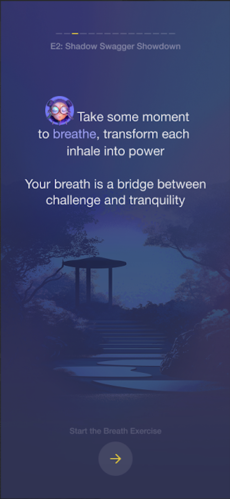
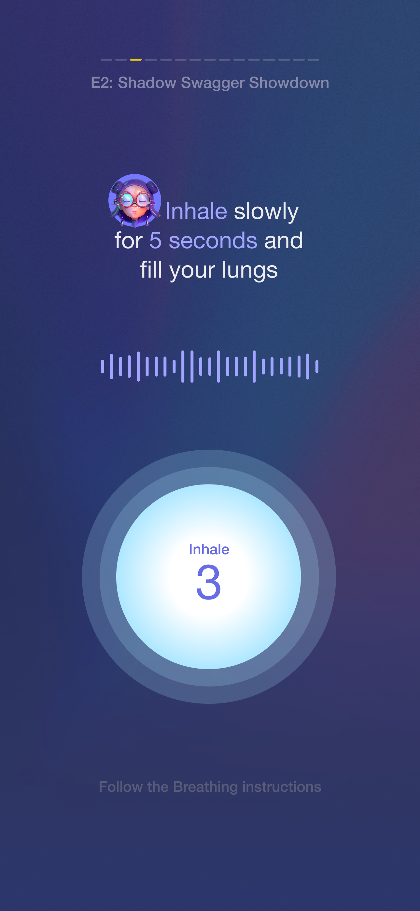
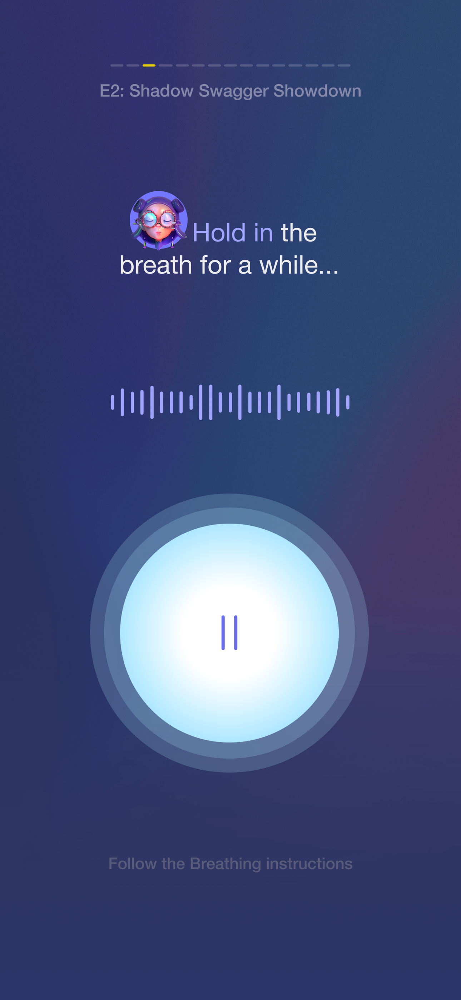
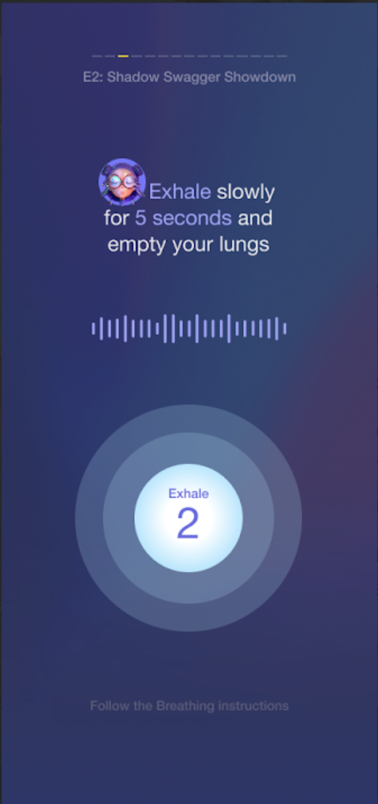
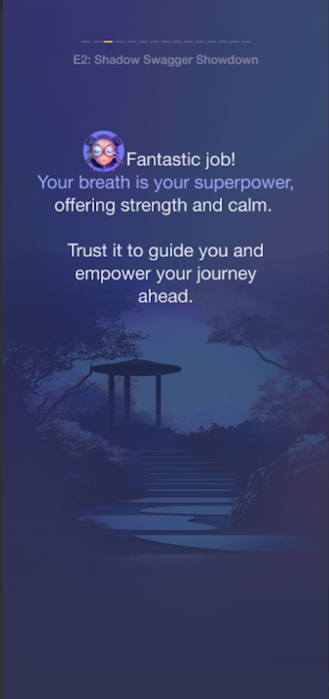
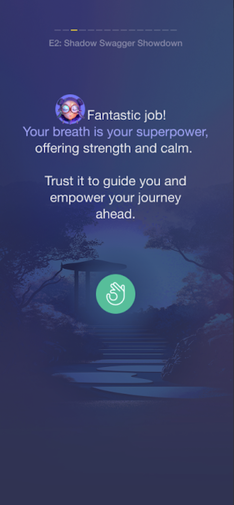
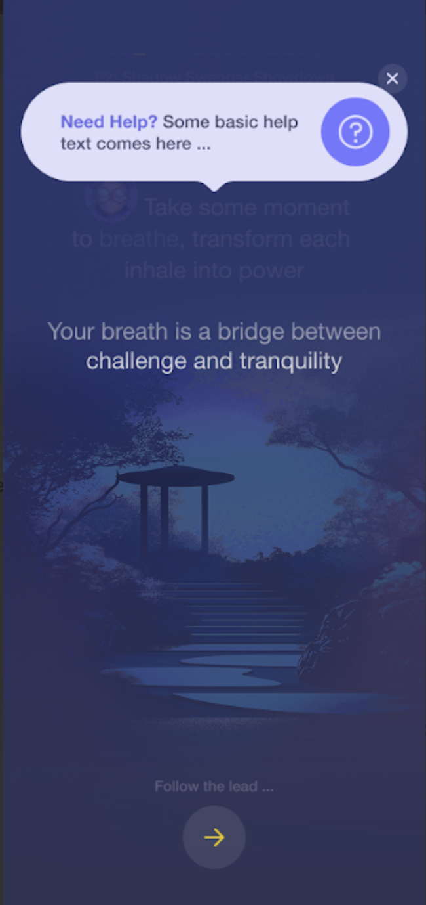

# 🧘‍♂️ PRD: Breathing Exercise – *E2: Shadow Swagger Showdown*
*A mental warm-up experience for FutureStars athletes*

---

## tl;dr

This feature delivers a guided breathing exercise that helps young sports talents mentally reset and refocus between challenges or episodes. Built into the FutureStars mobile app, this experience includes smooth animations, audio guidance from “The Oracle,” and calming music. It unfolds across four timed phases: Inhale, Hold, Exhale, and Success — with immersive UI to keep athletes in a flow state.

🔗 **Figma/Mockup Link for all screens**: 

---

## Goals

### Business Goals
- Increase engagement and retention by helping athletes mentally refocus.
- Establish immersive rituals that elevate the perceived value of the FutureStars program.

### User Goals
- Feel calm, focused, and mentally prepared before continuing challenges.
- Engage with a flow-driven experience that feels empowering, not clinical.

### Non-Goals
- No breath logging, progress tracking, or customization in V1.
- No audio-only mode or screen-reader accessibility.

---

## User Stories
- As a young athlete, I want a quick, powerful breathing exercise to feel stronger and calmer.
- As a user, I want visuals and voice guidance that are easy to follow.
- As a user, I want to clearly know when I’ve completed the exercise and can continue.

---

## User Experience Flow

### 🟣 1. Initial Screen / Oracle Intro

- Oracle Character says: *"Take a moment to breathe, transform each inhale into power."*
- Subtext: “Your breath is a bridge between challenge and tranquility.”
- Tap button begins exercise.
- Bubble is static, background is animated forest or training-ground theme.
- 🔊 Voiceover: Oracle speaks intro line.
- 🎵 Background music starts.

---

### 🔵 2. Inhale Phase

- Prompt: *“Inhale slowly for 5 seconds and fill your lungs.”*
- Animation: A glowing bubble descends slowly over 5 seconds.
- Timer overlay: “Inhale – 5 → 1”
- Oracle speaks the prompt.
- Smooth transition into Hold after 5 seconds.

---

### 🟡 3. Hold Phase

- Prompt: *“Hold the breath for a while…”*
- Oracle speaks once.
- Bubble pulses gently in place.
- Countdown optional (or hidden for immersive feel).
- Subtle waveform animates in background.
- Transitions automatically after 5 seconds.

---

### 🔴 4. Exhale Phase

- Prompt: *“Exhale slowly for 5 seconds and empty your lungs.”*
- Animation: Bubble rises or shrinks gradually over 5 seconds.
- Oracle speaks once.
- Subtle sound cue for breath out (e.g., air or wave).
- Transition to success after countdown.

---

### 🟢 5. Success Phase

- Message: *“Fantastic job! Your breath is your superpower, offering strength and calm.”*
- Subtext: *“Trust it to guide you and empower your journey ahead.”*
- Oracle speaks full text.
- Music fades out.
- Tap button continues to next episode (or placeholder screen).

---

### ❓ 6. Help / Info Bubble

- Tappable “?” bubble in top right.
- Opens modal: “Need Help? Some basic help text comes here...”
- No voiceover. Tap outside to dismiss.

---

## Narrative

FutureStars athletes face pressure. Their minds race with what’s ahead. The Breathing Exercise is their pause — a chance to claim a moment of clarity. With guidance from the Oracle, each breath isn’t just air — it’s strength. It’s discipline. It’s the same focus used by elite performers. When the user finishes the flow, they’re not just calm. They’re ready to conquer.

---

## Success Metrics

In V1, success will be evaluated qualitatively:
- Completion rate via internal QA
- Subjective reports during playtesting
- Early beta user feedback

(*Future opportunity: session logging, emotion tagging, rating after session*)

---

## Technical Considerations

| Area | Detail |
|------|--------|
| **Platform** | Flutter mobile-first (iOS, Android), also works on web |
| **Animations** | Bubble descent, pulsing hold, and ascent should use `AnimationController` |
| **Offline** | All audio and visuals must be available offline |
| **Audio Format** | `.mp3` (universal support) |
| **Voiceovers** | Preloaded audio files for Oracle: 5 clips total |
| **State Management** | Linear phase flow, with final screen requiring manual tap |
| **Error Handling** | If voiceover or music fails to load, fallback to text-only prompt |
| **Accessibility** | No screen reader/haptics for V1 — deferred for future |

---

## Milestones & Sequencing

| Week | Task |
|------|------|
| Week 1 | Create static UI scaffolding for all 5 screens |
| Week 2 | Implement animation timing and visual transitions (bubble, countdowns) |
| Week 3 | Integrate and sync audio (Oracle voiceovers + music + cues) |
| Week 4 | Add help bubble + error/fallback handling |
| Week 5 | Offline media setup and testing |
| Week 6 | QA + polish + prepare for user testing/beta |
